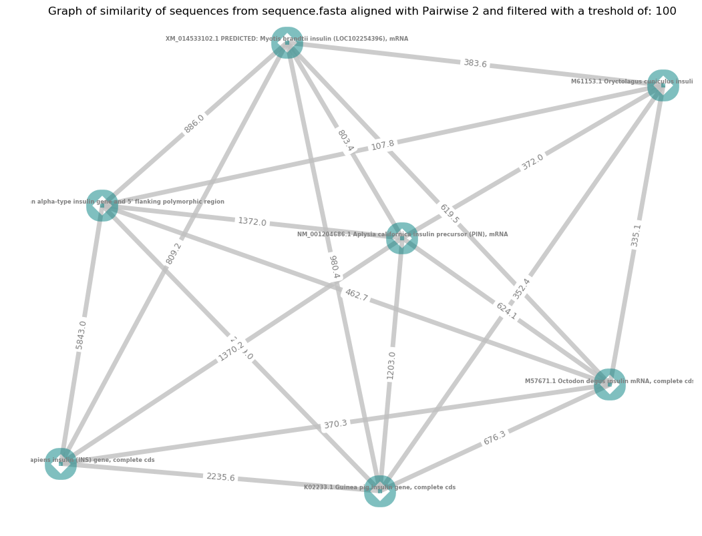

# Python_align

Python_align is a python script permitting to construct a network graph based on similarity between different DNA sequences from a fasta file. All files necessary are accessible on this [repository](https://bitbucket.org/TanguyLallemand/python_align/src/master/)

## Getting Started

These instructions will get you a copy of the project up and running on your local machine.

### Prerequisites

In order to run this script some python packages are necessary. List of package in python environment is contained in this [file](<Packages_used_for_virtual env/python_environment_used.txt>) (You can get it in Packages_used_for_virtual env/python_environment_used.txt).

### Installing

First you need to create a virtual environment for this script using these lines:

    conda create --name <env> --file python_environment_used.txt # Create a conda environment
    source activate <env> # Activate this environment to execute script in it

To follow, give execution rights to script and execute it

    chmod +x script_python.py
    ./script_python.py

If you prefer, just run setup.sh to create environment called python_align and execute this script giving sequence.fasta and using default configuration
## Use this script

You can call this script with different flags

### Flags available

To adjust what you want from script, it is possible to add some flags to script call.

List of possibles arguments and their effects:

    -a or -all to ask script to get all fasta files from current directory
    -c to give a numeric value working as a cut off
    -d or --default to let script choose for output file and directory names
    -e or --concatenate to concatenate graphs from different fasta files into one
    -p or --png to ask to save output graph in png
    -m or --pdf to ask to save output graph in pdf
    -s or --save to save alignments in a text file
    -h or --help to display a help message

You can also give as argument a name or path of a fasta file that you want to compute. Example: sequence.fasta or sub directory\sequence.fasta.
Please be careful, if script is called with a fasta file given as argument, flags must be after filename
### Examples of call:

     ./script_python.py -a -d

To ask script to work on all fasta files with default configuration

     ./script_python.py fasta_files/sequence.fasta -s

 To align all sequences from sequences.fasta with default cut off (100). Alignments produced will be saved in output_sequences.txt

    ./script_python.py -a -c 200

 Execute this script on all fasta files of current directory with 200 as cut off.

### Expected output

This repository contain some examples of expected output graph. They were generated using 'sequences.fasta' and 'test.fasta'. Output graph are saved by default in pdf to keep vectorial quality but it is possible with -p flag to ask for a png.
Here is an example of an output graph:

## Built With

-   [Anaconda](https://www.anaconda.com/) - Environment management
-   [Networkx](https://networkx.github.io/) - Python library used to generate network graph

## Author

-   **Tanguy Lallemand**, M2BB

##Theorie

Pairwise permit to perform global or local alignment. For this script we choose to work using global alignments. In fact, we want to know if sequences are globally similar. Local alignments are mostly used to search for sub sequences.
We need to configure global alignment function to perform alignment as wanted.
To do it we can give two parameters:
  - First parameter set up matches and mismatches.
  - Second set up gaps.
For this script, we give a match score for identical chars, a mismatch score is given if characters are different (correspond to m code). Moreover, same gap penalties are applied on both sequences (s code).
For calculate score, we can add supplementary parameters.
  - Match score: 2
  - Mismatch score: -1
  - Opening Gap: -0.5
  - Extending Gap: -0.1
