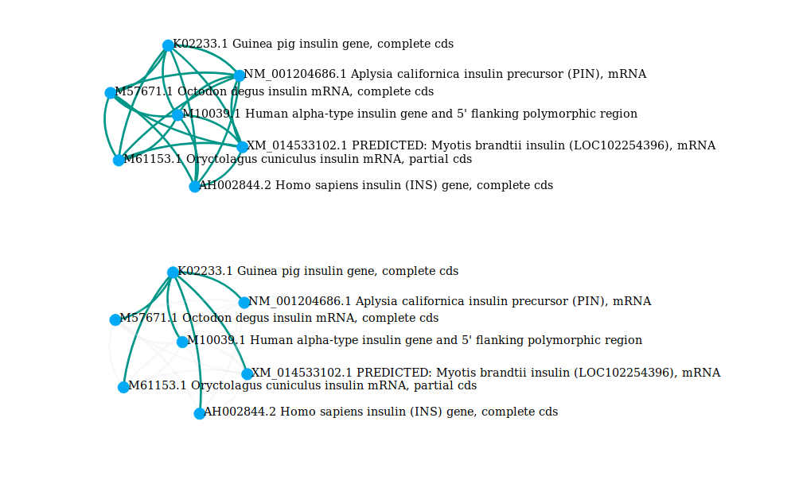

# Python_align

Python_align is a python script permitting to construct a network graph based on similarity between different DNA sequences from a fasta file. All files necessary are accessible on this [repository](https://bitbucket.org/TanguyLallemand/python_align/src/master/)

## Why this script is particular?

First of all, this script allows you to save your output graphs in different formats. It is of course possible to save it in gefx but also in png or pdf. In addition, it is possible to export the data in a json file and display an output graph in a web browser via a Javascript script. This allows to have beautiful graphics managed in d3.js with possible interactions. In addition, it is then possible to implement resulting output graph in any web page. To finish, json is a format very used, easy to parse so this file can be use in many different project.

This script is a fully modular script so it is quite easy to change configuration following needs of a particular experience or adapt it to a bigger project.

## Getting Started

These instructions will get you a copy of the project up and running on your local machine.

### Prerequisites

In order to run this script some python packages are necessary. List of packages necessary for this environment is contained in this [file](<Packages_used_for_virtual env/python_environment_used.txt>) (You can get it in Packages_used_for_virtual env/python_environment_used.txt).

### Installing

First you need to create a virtual environment for this script using these lines:

    conda env create -f python_align.yml # Create a conda environment
    source activate <env> # Activate this environment to execute script in it

Or you can use alternatively

    conda create --name <env> --file python_environment_used.txt # Create a conda environment
    source activate <env> # Activate this environment to execute script in it

To follow, give execution rights to script and execute it

    chmod +x script_python.py
    ./script_python.py

If you prefer, just run setup.sh to create environment called python_align and execute this script giving sequence.fasta and using default configuration
## Use this script

You can call this script with different flags

### Flags available

To adjust what you want from script, it is possible to add some flags to script call.

List of possibles arguments and their effects:

    usage: python_align.py [-h] [-a] [-f FILE] [-e] [-c [THRESHOLD]] [-d] [-p]
                       [-m] [-i]

    optional arguments:
    -h, --help            show this help message and exit
    -a, --all             Ask script to get all fasta files from current
                        directory

    -f FILE, --file FILE  Give a path or filename of a fasta file
    -e, --concatenate     Concatenate graphs from different fasta files into one
                        graph
    -c [THRESHOLD], --threshold [THRESHOLD]
                        Give a numeric value as threshold to select or not an
                        alignement
    -d, --default         Let script choose for output file and directory names
    -p, --png             Ask to save output graph in png
    -m, --pdf             Ask to save output graph in pdf
    -i, --interactive     Ask to display an interactive graph in a web browser
                        with D3.js

### Examples of call:

     ./python_align.py -a -d

To ask script to work on all fasta files with default configuration

     ./python_align.py -f fasta_files/sequence.fasta -i

 To align all sequences from sequences.fasta with default cut off (100). Output graph will be visualized in a web browser.

    ./python_align.py -a -c 200 --pdf

 Execute this script on all fasta files of current directory with 200 as cut off. Each results will be saved in pdf format

### Expected output

This repository contain some examples of expected output graph. They were generated using 'sequences.fasta' and 'test.fasta'. Output graph can be saved using different format such as gexf, png or pdf.
Here is an example of an output graph:

Moreover, it is possible to ask script to generate a Json file that will be used by a script written in JavaScript to display an interactive version of graph.
Here is some screenshots of what is possible to display in your favorite browser. You can display entire graph or just highlight links from a particular node.

## Pairwise 2 particular configuration

Python_align works based on a Biopython alignment function called Pairwise 2. This function is powerful and allows a fine configuration to meet various needs. Here is how Pairwise 2 was configured for this algorithm.

Pairwise permit to perform global or local alignment. For this script we choose to work using global alignments. In fact, we want to know if sequences are globally similar. Local alignments are mostly used to search for sub sequences.
We need to configure global alignment function to perform alignment as wanted.
To do it we can give two parameters:
  - First parameter set up matches and mismatches. We give a match score for identical chars, a mismatch score is given if characters are different (correspond to m code)
  - Second set up gaps.  Moreover, same gap penalties are applied on both sequences (s code).

For calculate score supplementary parameters were added.
  - Match score: 2
  - Mismatch score: -1
  - Opening Gap: -0.5
  - Extending Gap: -0.1

## Built With

-   [Anaconda](https://www.anaconda.com/) - Environment management
-   [Networkx](https://networkx.github.io/) - Python library used to generate network graph
-   [Force Directed Graph by Martin Chorley](https://bl.ocks.org/martinjc/7aa53c7bf3e411238ac8aef280bd6581) - A force directed graph built with D3.js
## Author

-   **Tanguy Lallemand**, M2BB
