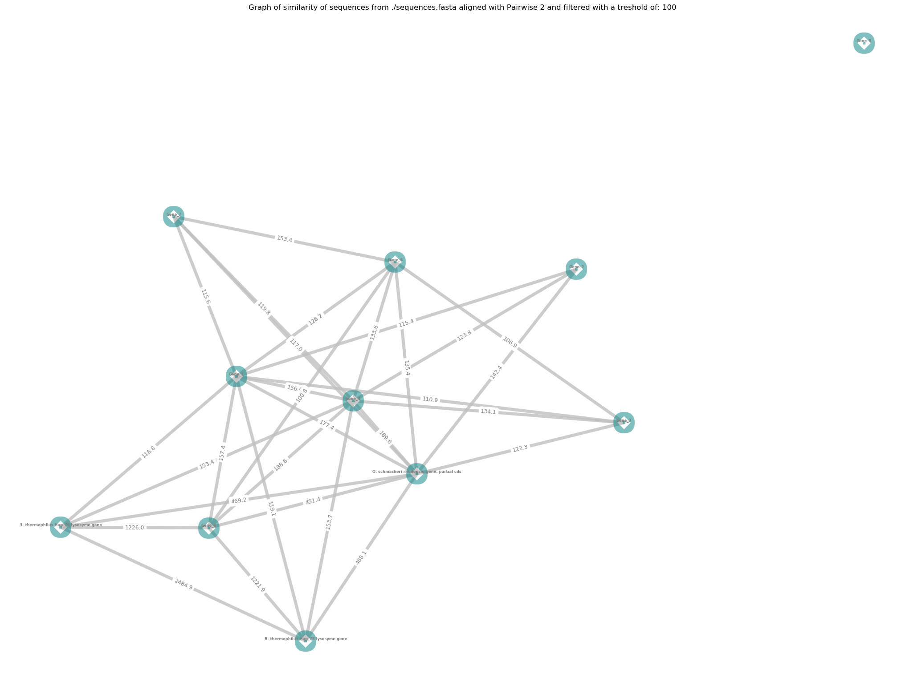

# Python_align

Python_align is a python script permitting to construct a network graph based on similarity between different DNA sequences from a fasta file.

## Getting Started

These instructions will get you a copy of the project up and running on your local machine.

### Prerequisites

In order to run this script some python packages are necessary. List of package in python environment is contained in this [file](<Packages_used_for_virtual env/python_environment_used.txt>) (You can get it in Packages_used_for_virtual env/python_environment_used.txt).

### Installing

First you need to create a virtual environnement for this script using these lines:

    conda create --name <env> --file python_environment_used.txt # Create a conda environment
    source activate <env> # Activate this environment to execute script in it

To follow, give execution rights to script and execute it

    chmod +x script_python.py
    ./script_python.py

## Use this script

You can call this script with different flags

### Flags available

To adjust what you want from script, it is possible to add some flags to script call.

List of possibles arguments and their effects:

    -a or -all to ask script to get all fasta files from current directory
    -c to give a numeric value working as a cut off
    -d or --default to let script choose for output file and directory names
    -e or --concatenate to concatenate graphs from different fasta files into one
    -p or --png to ask to save output graph in png
    -s or --save to save alignements in a text file
    -h or --help to display a help message

You can also give as argument a name or path of a fasta file that you want to compute. Example: sequences.fasta or subdirectory\sequences.fasta
### Examples of call:

     ./script_python.py -a -d

To ask script to work on all fasta files with default configuration

     ./script_python.py sequences.fasta -s

 To align all sequences from sequences.fasta with default cut off (100). Alignements produced will be saved in output_sequences.txt

    ./script_python.py -a -c 200

 Execute this script on all fasta files of current directory with 200 as cut off.

### Expected output

This repository contain some examples of expected output graph. They were generated using 'sequences.fasta' and 'test.fasta'. Output graph are saved by default in pdf to keep vectorial quality but it is possible with -p flag to ask for a png.
Here is an example of an output graph:

## Built With

-   [Anaconda](https://www.anaconda.com/) - Environment management
-   [Networkx](https://networkx.github.io/) - Used to generate network graph

## Author

-   **Tanguy Lallemand**
